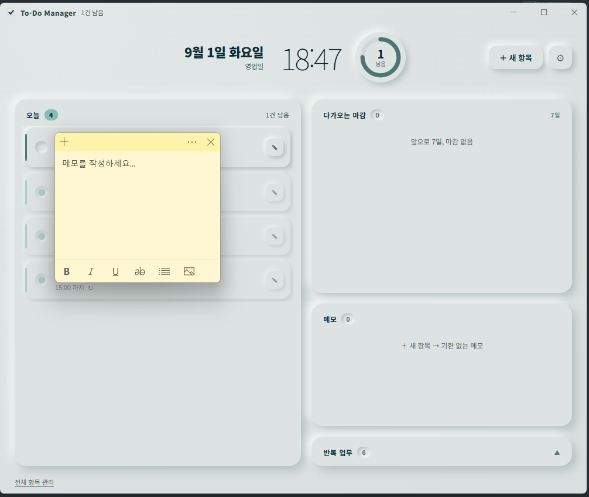
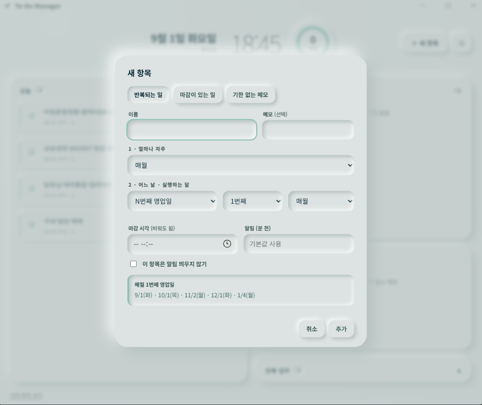

# To-Do Manager

A small Windows desktop app for people whose work is mostly recurring: it keeps
track of routine tasks that land on business days rather than plain calendar
dates — the second business day of the month, the last Thursday, three business
days before month end — and quietly shifts anything that falls on a weekend or a
Korean public holiday. Alongside those you can drop in one-off deadlines and
loose notes with no date at all. Close the window and it keeps running in the
background, sliding a soft notification card into the corner of the screen a
little before something is due, so the whole thing stays out of your way until
it actually has something to say.

Adding a routine — pick how often, pick the rule, and it shows you the next five
dates before you commit.

